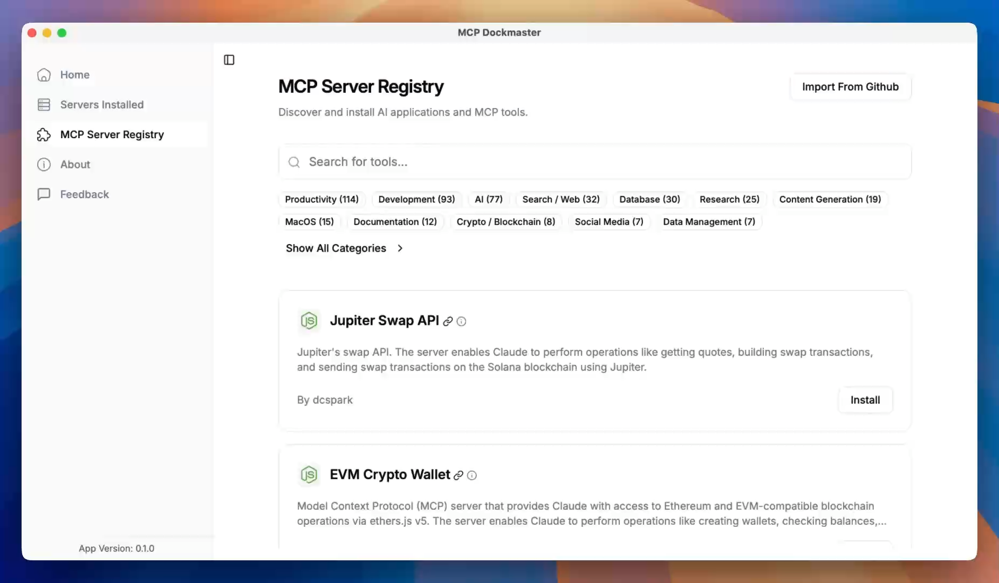

# MCP Dockmaster

MCP Dockmaster is a straightforward tool designed to help you easily install, manage, and monitor AI applications using MCP (Model Context Protocol). MCP is an open-source standard created by Anthropic that allows AI apps like Claude Desktop or Cursor to seamlessly access data from platforms such as Slack or Google Drive, interact with other applications, and connect to APIs.

## Demo

[](https://mcp-dockmaster.com/dockmaster-demo.mp4)

<video src="https://mcp-dockmaster.com/dockmaster-demo.mp4" controls></video>

<!-- If the video embedding doesn't work, here's a direct link -->
[Watch Demo Video](https://mcp-dockmaster.com/dockmaster-demo.mp4)

# MCP Dockmaster Monorepo

This is a monorepo for the MCP Dockmaster project, managed with NX. A monorepo is a single repository that holds multiple projects, which can be related or independent. NX is a set of extensible dev tools for monorepos, which helps in managing and scaling the projects efficiently.

## Structure

- `apps/mcp-dockmaster`: The main Tauri application, which is a desktop application built using Tauri, a framework for building tiny, fast binaries for all major desktop platforms.
- `apps/mcp-proxy-server`: The MCP proxy server, which handles network requests and serves as a middleware between the client and the server.

## Getting Started

### Prerequisites

- Node.js (v18 or later): A JavaScript runtime built on Chrome's V8 JavaScript engine.
- npm (v8 or later): A package manager for JavaScript, included with Node.js.

### Installation

1. Clone the repository using Git, a distributed version control system.
2. Install dependencies using `npm ci`, which installs dependencies from the lock file, ensuring a consistent environment.

## Development

### Running applications

To run the Dockmaster application:

```bash
npx nx dev mcp-dockmaster
```
This command starts the development server for the Dockmaster application.

For Tauri development:

```bash
npx nx tauri:dev mcp-dockmaster
```
This command is used for developing the Tauri application, providing a live-reload environment.

To build the MCP Runner:

```bash
npx nx build mcp-proxy-server
```
This command compiles the MCP proxy server, preparing it for production deployment.

### Running commands across all projects

```bash
# Build all projects
npx nx run-many -t build
```
This command builds all projects in the monorepo.

```bash
# Run tests across all projects
npx nx run-many -t test
```
This command runs tests for all projects, ensuring code quality and functionality.

```bash
# Lint all projects
npx nx run-many -t lint
```
This command checks the code for potential errors and enforces coding standards.

## Using NX

### Running tasks

```bash
# Run a task for a specific project
npx nx <task> <project>
```
This command allows you to run specific tasks, such as build or test, for a particular project.

### Visualizing the project graph

```bash
npx nx graph
```
This command generates a visual representation of the project dependencies, helping you understand the relationships between different parts of the monorepo.

### Running tasks in parallel

```bash
npx nx run-many --target=build --parallel=3
```
This command runs multiple tasks in parallel, improving efficiency and reducing build times.

### Affected commands

```bash
# Run tasks only for projects affected by changes
npx nx affected --target=build
```
This command optimizes the build process by only running tasks for projects that have been modified, saving time and resources.

## Learn More

- [NX Documentation](https://nx.dev) 
The official NX documentation provides comprehensive guides and API references to help you get the most out of NX.                              
